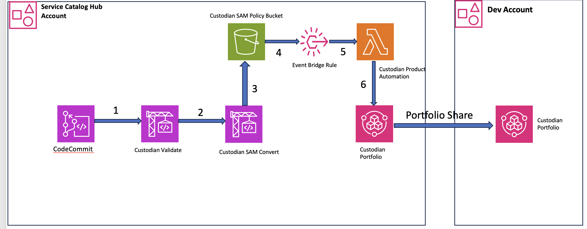

# Enabling Self Service for Cloud Custodian policies on AWS using AWS Service Catalog

This solution shows how to enable Self Service capability for Custodian policy leveraging Service catalog in the multi account environment

## Solution architecture and design

## 

1. Portfolio administrators to add the Custodian policy file and the role permission file required for the custodian policy to the AWS CodeCommit repository

2. The AWS Codepipeline gets invoked which will validate the custodian policy, convert the custodian policy to SAM template

3. The SAM templates are uploaded to s3 bucket

4. The Event bridge rule will invoke the Lambda function during the object creation in s3 bucket 

5. Lambda function will create Service catalog product in a Portfolio that is shared

## Deployment Steps: 

### Pre-requistes 

* 2 AWS Identity and Access Management (IAM) accounts as part of AWS Organizations with administrator privileges for the services used in this solution.
    a. Service catalog Account - Used to provision the Custodian policy as a Service catalog
    product in a portfolio
    b. Developer account - End User to launch the Service catalog product

* Ensure Trusted Access is Enabled for Service Catalog. Review the [steps](https://docs.aws.amazon.com/organizations/latest/userguide/services-that-can-integrate-servicecatalog.html) to enable trusted access for service catalog.

* Ensure the Service catalog account is enabled as Delegated administrator account for AWS Service Catalog in the Organizations Management Account. Run the below CLI command to register an account as delegated admin from the Organizations Management Account. 

```
aws organizations register-delegated-administrator \
    --account-id service-catalog-account-id \
    --service-principal servicecatalog.amazonaws.com
```

* The solution requires Service catalog portfolio provisioned in the Service catalog delegated admin account with porfolio sharing enabled. Provision Portofolio as CloudFormation stack leveraging the [Portfolio template](./cloudformation_templates/sc_custodian_portfolio.yml)

* Provision Launch constraint Role as CloudFormation stack Set leveraging the [Launch Constraint template](./cloudformation_templates/sc_launch_constraint_role.yml)

### Infrastructure Provisioning 

* Provision the Product pipeline Infrastructure as CloudFormation stack leveraging the [Automation pipeline template](./cloudformation_templates/custodian_automation_pipeline.yml)

### Adding the Custodian Policy 

* Clone the code commit repository created as part of the Infrastructure Provisioning. 

* Copy all the codecommit-files from this repository to the cloned code commit repository. 

* Create a sub folder in the cc_policies which will be used as Service catalog Product Name.The Folder should contain custodian policy YAML file and permissions.yml that will contain permissions for the Lambda Role. 

* Commit and push the changes to the code commit repository. 

* Once the Product Creation Code Pipeline is completed successfully you will notice Service catalog Product created under the Portfolio. 

## Authors

Gopinath Jagadesan - Senior Cloud Infrastructure Architect - gopinjag@amazon.com 

Mokshith Kumar - Senior Cloud Infrastructure Architect - tumallap@amazon.com

Satish Kumar Nadendla - Senior Cloud Infrastructure Architect - nadsatis@amazon.com

## Security

See [CONTRIBUTING](CONTRIBUTING.md#security-issue-notifications) for more information.

## License

This library is licensed under the MIT-0 License. See the LICENSE file.
